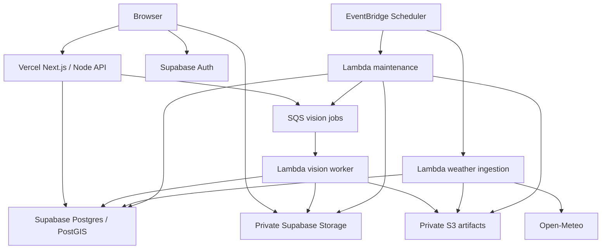

<h1 align="center">MonsoonRoute</h1>

<p align="center">
  <strong>Evidence-aware monsoon route planning for a bounded Central Delhi pilot</strong><br>
  Compare an ordinary car route with a lower modeled-risk alternative under an explicit detour budget, while showing what evidence supports the recommendation and when the system should abstain.
</p>

<p align="center">
  
  
  
  
  
  
</p>

<p align="center">
  <a href="#overview">Overview</a> ·
  <a href="#what-this-repo-is">Scope</a> ·
  <a href="#planned-features">Features</a> ·
  <a href="#architecture">Architecture</a> ·
  <a href="#user-flows">User Flows</a> ·
  <a href="#implementation-status">Status</a>
</p>

---

## Overview

**MonsoonRoute** is a hackathon implementation specification for an evidence-aware road-waterlogging decision aid.

The target product compares:

1. an ordinary passenger-car route; and
2. a lower **modeled-risk** route

within a user-selected detour budget.

The system is deliberately conservative about what it claims. It is a **decision aid**, not a certified safety-navigation system. It does not promise that a recommended road is physically safe, dry, or passable.

The core idea is:

```text
Origin + destination + detour budget + planning horizon
  ↓
Road graph + static susceptibility + weather forcing
  ↓
Reviewed reports + active closures
  ↓
Versioned relative-risk scoring
  ↓
Deterministic candidate routes
  ↓
Closure filter + detour contract
  ↓
Baseline route vs lower modeled-risk route
  ↓
Evidence, source age, reasons, and uncertainty
```

---

## What This Repo Is

This repository is currently governed by a detailed implementation source of truth and event-start execution plan.

The intended implementation scope includes:

| Area | Target implementation |
|---|---|
| Geography | Bounded Central Delhi pilot, not citywide India navigation. |
| Travel profile | Passenger-car route planning with static travel-time estimates. |
| Risk output | Versioned relative risk index, evidence coverage, source age, reason codes, and reviewed closures. |
| Weather | Current, +1 h, and +3 h planning views using gridded precipitation inputs. |
| Routing | Deterministic route candidates under a 0–30% detour cap with hard closure exclusion. |
| Frontend/API | Next.js App Router + TypeScript + Vercel Node functions. |
| Data | Supabase Postgres/PostGIS + Auth + private Storage. |
| AWS | S3, Lambda, SQS/DLQ, EventBridge Scheduler, Secrets Manager, CloudWatch, IAM/STS, Budgets. |
| Vision assistance | `prithivMLmods/Flood-Image-Detection` exported to ONNX for CPU Lambda assistance during photo review. |
| Maps | MapLibre GL JS with project-served OSM-derived GeoJSON roads. |
| Explanations | Deterministic bilingual explanation templates; no external LLM required for the mandatory build. |

---

## Planned Features

| ID | Behavior |
|---|---|
| Route planning | Choose origin/destination from map points or supported landmarks. |
| Detour contract | Set a 0–30% detour budget; every recommendation must visibly obey it. |
| Time horizon | Compare current, +1 h, or +3 h planning views. |
| Evidence-linked risk | Inspect road risk index, evidence coverage, reasons, source time, graph version, and ruleset. |
| Closure handling | Active reviewed closures are hard-excluded from recommendations. |
| Evidence-aware abstention | Stale/missing conditions remove unsupported weather-risk comparisons instead of silently guessing. |
| Structured reports | Authenticated users can submit road observations and optional private photos. |
| Human moderation | AI can assist photo review; a human moderator decides approve/reject/resolve and closure actions. |
| Replay/scenario mode | Deterministic historical/synthetic scenario playback clearly labeled as non-live. |
| Provenance | Weather run, graph, ruleset, report IDs, closure records, hashes, and replay clock are auditable. |
| Privacy | Public routes do not expose uploader identity, private photos, or raw report coordinates. |
| Recovery | Durable jobs and idempotent processing avoid duplicate decisions and permanent queue-loss behavior. |
| Accessibility | Responsive UI, keyboard alternatives, sufficient contrast, and non-color-only communication. |

---

## Four Core Product Differentiators

### 1. Explicit Detour Contract

Every recommendation must show:

- baseline duration;
- allowed detour cap;
- achieved detour;
- modeled-risk comparison.

If no candidate meets the contract, the system should say so instead of returning an unconstrained “safer” route.

### 2. Evidence-Aware Abstention

Freshness, missing terrain inputs, report review state, and conflicting evidence are visible.

If weather becomes too stale, the application degrades to closure-aware planning rather than pretending that old weather still supports a meaningful risk comparison.

### 3. Reproducible Local Evidence

A route decision can be tied to:

- graph version;
- weather run;
- ruleset;
- active reviewed reports;
- closures;
- hashes;
- scenario/replay time.

The goal is auditability, not unexplained AI output.

### 4. Integrated Low-Cost Pilot

The target architecture connects:

- weather ingestion;
- private evidence/photo handling;
- human review;
- risk scoring;
- route comparison;
- replay;
- AWS processing;
- provenance;

inside one bounded pilot instead of treating cloud services as decorative architecture boxes.

---

## User Flows

### Route Planner

```text
Open /plan
  ↓
Choose origin + destination
  ↓
Choose detour budget
  ↓
Choose current / +1 h / +3 h
  ↓
Request route comparison
  ↓
View baseline + lower modeled-risk alternative
  ↓
Inspect evidence / reasons / source age
  ↓
Adjust detour and recompute
```

No account is required for route comparison.

### Reporter

```text
Sign in with GitHub
  ↓
Choose road / observation / time
  ↓
Create draft report
  ↓
Optionally upload private photo
  ↓
Finalize report
  ↓
Asynchronous vision assistance
  ↓
Pending human review
```

Submitting a report does not automatically change public routing.

### Moderator

```text
Open review queue
  ↓
Verify authorization
  ↓
Inspect structured report + private processed evidence
  ↓
Approve / reject / resolve
  ↓
Optionally create short closure
  ↓
Record audit reason
  ↓
Next route query uses reviewed evidence
```

### Judge / Demo

```text
Open seeded scenario
  ↓
Compare routes
  ↓
Show detour contract
  ↓
Submit demonstration photo
  ↓
Observe AWS processing
  ↓
Approve demonstration evidence
  ↓
Recompute route
  ↓
Inspect provenance / replay / metrics
```

---

## Architecture



### Runtime Boundaries

- Browser receives only public configuration.
- Supabase is the authoritative application state.
- Vercel performs validated route/report API operations.
- AWS handles scheduled ingestion, async photo analysis, archival, and maintenance.
- SQS messages remain minimal; database state is authoritative.
- AI/image classification assists review but cannot autonomously approve reports or close roads.
- No public AWS API endpoint is required for the mandatory architecture.

---

## Risk / Routing Principles

The mandatory build uses a **relative risk index**, not a calibrated flood probability.

The router should:

1. build deterministic candidate routes;
2. exclude active hard closures;
3. enforce the user’s detour cap;
4. score modeled exposure using versioned evidence;
5. return the best feasible candidate under that contract;
6. expose why it was selected.

The system should **not** claim:

- globally optimal constrained routing;
- water-depth prediction;
- guaranteed road safety;
- locally validated meteorological nowcasting;
- emergency-response suitability.

---

## Vision Assistance

The selected model is used only to assist human review of submitted flood/waterlogging photos.

Target deployment:

```text
Private photo
  ↓
Durable job
  ↓
CPU ONNX Lambda
  ↓
Sanitized image / logits / score
  ↓
Stored evidence
  ↓
Human moderator decision
```

The classifier is not permitted to autonomously create closures or treat an image score as physical ground truth.

---

## Security & Privacy

The planned implementation requires:

- Supabase RLS and private Storage;
- service-role secrets only on trusted server/Lambda paths;
- GitHub OAuth for reporter/moderator identity;
- role-based moderator authorization in the database;
- bounded request/response sizes;
- rate/quota controls;
- private evidence coordinates/photos;
- audited moderation decisions;
- AWS least-privilege IAM/OIDC roles;
- private S3 artifacts;
- secret rotation procedures;
- no root/runtime credential reuse.

---

## Proposed Repository Structure

```text
MonsoonRoute/
├── app/
├── components/
├── lib/
│   ├── routing/
│   ├── risk/
│   ├── evidence/
│   ├── auth/
│   └── supabase/
├── api/
├── supabase/
│   └── migrations/
├── aws/
│   ├── ingestion/
│   ├── vision/
│   ├── maintenance/
│   └── template.yaml
├── scripts/
├── tests/
├── docs/
│   ├── source-of-truth.md
│   ├── implementation-plan.md
│   ├── access-readiness.md
│   ├── deployment-receipt.md
│   └── secret-rotation.md
├── public/
├── package.json
├── vercel.json
└── README.md
```

The exact tree must follow the implementation source of truth when implementation begins.

---

## Implementation Status

**Current status: specification / event-start implementation package.**

This README intentionally does **not** claim that the following are already complete:

- application code;
- database migrations;
- production Supabase schema;
- AWS workload resources;
- deployed Lambda/SQS/S3 pipeline;
- ONNX parity/latency benchmark;
- field validation;
- controlled route-outcome accuracy;
- calibrated flood probability.

Those become implementation claims only after the corresponding code, deployment, tests, and evidence actually exist.

---

## Validation Required Before Stronger Claims

The final implemented system should verify:

- route-contract correctness;
- closure exclusion;
- stale-weather abstention;
- deterministic replay;
- RLS and role authorization;
- private Storage policy;
- queue idempotency and recovery;
- model export/parity/memory/cold-start behavior;
- AWS IAM deny boundaries;
- deployment commit identity;
- latency against stated targets;
- field observations across independent rain events.

---

## Important Notes

- “Lower modeled risk” is the correct product language; “safe route” is not.
- The pilot is intentionally geographically bounded.
- Weather-grid resolution does not become road-level physical measurement merely because results are linked to road edges.
- Reviewed reports are evidence, not guaranteed field truth.
- A functional implementation is not the same as validated real-world flood-risk accuracy.

---

## License

Add the project license selected for the final hackathon repository and keep third-party data/model/source attribution alongside it.
